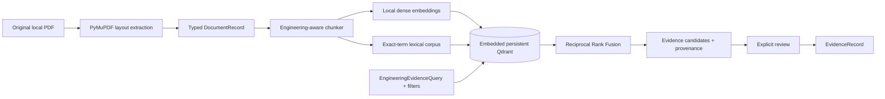

# CircuitAI Phase 2: Datasheet Knowledge and Evidence Retrieval

CircuitAI is a local, fail-closed foundation for AI-assisted PCB engineering. Phase 2 adds a
provenance-preserving knowledge pipeline for manufacturer datasheets, reference designs, and
application notes. It retrieves **evidence candidates**; it does not treat retrieved text or an LLM
response as a validated engineering fact, and it does not design circuits.

## Requirements and setup

- Python 3.12+
- Local storage for source PDFs, extracted records, and a Qdrant index
- Ollama is optional and is not used for ingestion, indexing, or retrieval

```bash
python -m venv .venv
.venv\Scripts\activate
python -m pip install -e ".[dev]"
```

Copy `.env.example` to `.env` to override configuration. `OLLAMA_MODEL` remains an explicit
operator choice. The default embedding model is `BAAI/bge-small-en-v1.5`, a compact English
retrieval model (384 dimensions) that is practical on CPU and small enough for the target RTX 3060.
It runs through FastEmbed/ONNX and therefore does not require the main Ollama Qwen model to remain
loaded. Set `EMBEDDING_DEVICE=cpu` (default) or `cuda`; CUDA requires a compatible ONNX Runtime GPU
installation. Model files and content-addressed embeddings are cached locally.

## Ingestion and provenance

Place PDFs without modifying them under one of these source directories:

```text
knowledge/
    datasheets/
    reference_designs/
    app_notes/
```

PyMuPDF extracts pages as ordered layout blocks and detected tables, retaining document SHA-256,
source path/type, document metadata, page, section, block/table IDs, and bounding boxes. Heading
font/layout cues establish section context. Pages below the configurable machine-readable-text
threshold are marked `REQUIRES_OCR`; OCR is intentionally not a normal-path fallback. Corrupt,
unsupported, empty, or extraction-invalid documents fail explicitly.

Document and chunk IDs are derived deterministically from content and source layout. Re-indexing an
unchanged source returns an idempotent report and does not add points. When a source path changes
hash, old current-index points are removed while the prior extracted record remains available as
history.



Generated records, vector data, and embedding caches default to `projects/local_runtime/` and are
ignored by Git. Original PDFs remain untouched. These paths are configurable with
`AI_PCB_INDEX_DIR`, `AI_PCB_INGESTION_DIR`, and `EMBEDDING_CACHE_DIR`.

## Engineering-aware chunking

Chunking prefers section, heading, paragraph, and table boundaries over fixed size. It recognizes
layout headings and preserves electrical-characteristics, ratings, power, clocks, interfaces,
application, and layout sections when those headings are present. Tables remain whole unless a
configured hard limit requires row batching; every batch repeats the complete header so row meaning
is retained. Oversized prose is split only after paragraph/sentence boundaries are attempted.

Every chunk stores previous/next IDs. Controlled context expansion can add only a bounded number of
neighbors and retains a separate locator for each included piece. It never concatenates arbitrary
page ranges.

## Hybrid retrieval

Retrieval is backend-independent through `EvidenceRetriever` and `EmbeddingProvider` protocols.
The default backend uses embedded Qdrant for persistent dense vectors and validated payloads, plus a
local BM25-style lexical rank over the filtered Qdrant corpus. Lexical tokenization preserves terms
such as `ADAU1467`, `AVDD`, `MCLK`, `THD+N`, register names, and pin numbers. Metadata filtering is
applied independently to both paths before Reciprocal Rank Fusion (RRF).

The returned fused score is a normalized relative RRF score for the current query, not a calibrated
probability. Dense similarity, lexical relevance, fused retrieval score, LLM extraction confidence,
and deterministic engineering validation status are deliberately separate fields.

## CLI

```bash
# Existing Phase 1 project operations
python -m ai_pcb.cli init example
python -m ai_pcb.cli validate-spec example
python -m ai_pcb.cli run example
python -m ai_pcb.cli show-state example

# Phase 2 knowledge operations
python -m ai_pcb.cli ingest
python -m ai_pcb.cli ingest knowledge/datasheets/ADAU1467.pdf
python -m ai_pcb.cli search "What supply voltage does the DSP core require?"
python -m ai_pcb.cli search "PLL_CTRL MCLK" --part-number ADAU1467 --context 1
python -m ai_pcb.cli evidence-query "THD+N at 48 kHz"
python -m ai_pcb.cli retrieval-eval knowledge/evaluation/my_queries.json
```

`search` prints document, page, section, normalized RRF score, method, and a short source preview.
`evidence-query` emits the full typed candidates including hash, locator, component IDs, individual
scores, and expanded context. Callers never construct raw Qdrant queries.

## Evidence trust boundary and fact extraction

Manufacturer documents can be acquired from a typed YAML manifest. Only allowlisted manufacturer
domains are contacted, every redirect is rechecked, originals are content-addressed, and only
identity-verified PDFs can flow into Phase 2 ingestion:

```bash
python -m ai_pcb.cli acquire-documents projects/anc_controller_v1/evidence_manifest.yaml
python -m ai_pcb.cli acquire-documents projects/anc_controller_v1/evidence_manifest.index.yaml --ingest
```

Acquisition metadata and content-change events are separate from immutable source files. A changed
response creates a new version; an unchanged response is idempotent. `MODEL_GENERATED` URL origins
must be curated before the provider will contact them.

Retrieval output is candidate material only. `promote_retrieval_candidate` requires explicit review,
copies source text and provenance into the existing `Evidence` contract, and deliberately does not
map retrieval score into evidence confidence. A model-generated statement cannot be passed to that
promotion boundary.

`extract_engineering_fact` sends only a bounded set of retrieved candidates to `StructuredLLM`. Its
system prompt prohibits prior knowledge and unsupported calculations, and its Pydantic result must
cite only supplied candidate IDs. Missing support produces `INSUFFICIENT_EVIDENCE`; incompatible
sources produce `CONFLICTING_EVIDENCE` with all references and no selected value. Malformed output or
invented references fail closed. Configurable source precedence orders conflict review but never
deletes conflicts or assumes that different operating conditions are comparable.

## Retrieval evaluation

Evaluation cases contain a typed query and expected document plus optional page/chunk. The harness
computes Recall@1, Recall@3, Recall@5, and mean reciprocal rank (MRR). Unit tests build a deterministic datasheet-like PDF
and a deterministic semantic corpus without network access. This synthetic baseline verifies the
mechanism; it is not evidence of production retrieval quality. Add a local evaluation JSON file using
the `RetrievalEvaluationCase` schema after indexing representative documents.

```bash
python -m pytest
python -m ruff check .
python -m mypy
```

Tests marked `integration` are the only tests allowed to require a live Ollama service.

## Known limitations and Phase boundary

- OCR, figure/schematic interpretation, cross-page table reconstruction, and scanned-document
  recovery are deferred; affected pages are explicit.
- Manufacturer/part/revision detection uses PDF metadata and conservative text/filename heuristics;
  operators can supply authoritative metadata during programmatic ingestion.
- Layout heuristics cannot perfectly recover every vendor's multi-column or unusually formatted PDF.
- The exact-term ranker currently scans the metadata-filtered local payload corpus; very large
  corpora will need a persistent inverted/sparse index without changing the retrieval abstraction.
- RRF scores are query-relative and are not engineering confidence or validation.
- Synthetic and real manufacturer evaluation data are reported separately. The current real corpus
  is a fixed 31-query Phase 3.1 baseline; its misses remain categorized rather than hidden.
- Fact extraction requires a configured `StructuredLLM`, but ingestion/retrieval/tests do not.

Phase 3.1 supports evidence-aware architecture and component closure. Schematic generation, KiCad
automation, PCB layout, circuit validation, and manufacturing generation remain explicitly out of
scope and no Phase 4 implementation is present.
